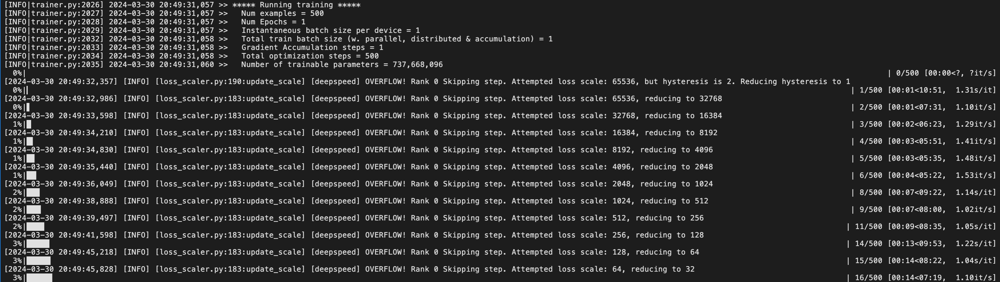
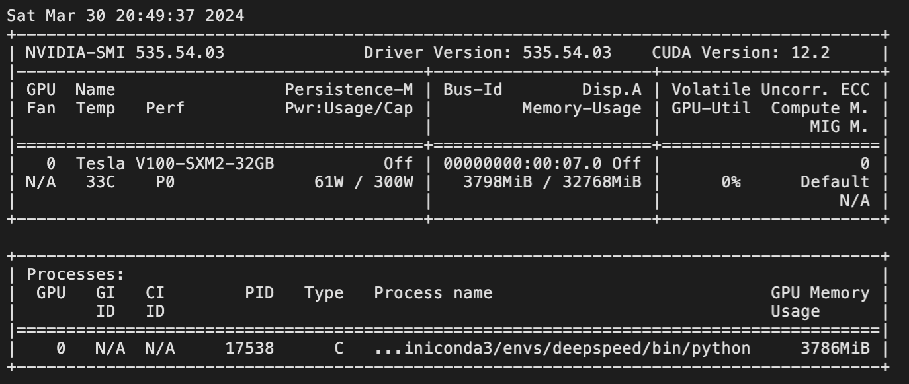
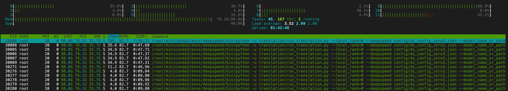

### 环境搭建

创建隔离Python环境

```python
conda create --name deepspeed python==3.11 -y
```

安装环境依赖

```python
# 克隆DeepSpeed项目
git clone https://github.com/microsoft/DeepSpeed/

# 安装DeepSpeed/requirements/requirements.txt文件中指定的依赖
pip install -r requirements.txt

# 补充安装缺失的依赖
pip install datasets evaluate accelerate sacrebleu

# 源码安装transformers
pip install git+https://github.com/huggingface/transformers

# 源码安装DeepSpeed
# 根据你的 GPU 实际情况设置参数 TORCH_CUDA_ARCH_LIST
# 如果你需要使用 CPU Offload 优化器参数，设置参数 DS_BUILD_CPU_ADAM=1
# 如果你需要使用 NVMe Offload，设置参数 DS_BUILD_UTILS=1
cd DeepSpeed
TORCH_CUDA_ARCH_LIST="7.5" DS_BUILD_CPU_ADAM=1 DS_BUILD_UTILS=1 pip install . \
--global-option="build_ext" --global-option="-j8" --no-cache -v \
--disable-pip-version-check 2>&1 | tee build.log
```

### DeepSpeed ZeRO-2 模式单 GPU 训练翻译模型（T5-Small）

DeepSpeed ZeRO-2 配置

```json
{
    "fp16": {
        "enabled": "auto",
        "loss_scale": 0,
        "loss_scale_window": 1000,
        "initial_scale_power": 16,
        "hysteresis": 2,
        "min_loss_scale": 1
    },

    "bf16": {
        "enabled": "auto"
    },

    "optimizer": {
        "type": "AdamW",
        "params": {
            "lr": "auto",
            "betas": "auto",
            "eps": "auto",
            "weight_decay": "auto"
        }
    },

    "scheduler": {
        "type": "WarmupLR",
        "params": {
            "warmup_min_lr": "auto",
            "warmup_max_lr": "auto",
            "warmup_num_steps": "auto"
        }
    },

    "zero_optimization": {
        "stage": 2,
        "offload_optimizer": {
            "device": "cpu",
            "pin_memory": true
        },
        "allgather_partitions": true,
        "allgather_bucket_size": 2e8,
        "overlap_comm": true,
        "reduce_scatter": true,
        "reduce_bucket_size": 2e8,
        "contiguous_gradients": true
    },

    "gradient_accumulation_steps": "auto",
    "gradient_clipping": "auto",
    "steps_per_print": 20,
    "train_batch_size": "auto",
    "train_micro_batch_size_per_gpu": "auto",
    "wall_clock_breakdown": false
}
```

训练脚本

```shell
deepspeed --num_gpus=1 translation/run_translation.py \
--deepspeed config/ds_config_zero2.json \
--model_name_or_path t5-small \
--do_train \
--do_eval \
--per_device_train_batch_size 1 \
--per_device_eval_batch_size 1 \
--max_train_samples 500 \
--max_eval_samples 100 \
--num_train_epochs 1 \
--output_dir output_dir --overwrite_output_dir --fp16 \
--dataset_name wmt16 --dataset_config "ro-en" \
--source_lang en --target_lang ro
```

训练过程


### DeepSpeed ZeRO-2 模式单 GPU 训练翻译模型（T5-Large）

DeepSpeed ZeRO-2 配置

```json
{
    "fp16": {
        "enabled": "auto",
        "loss_scale": 0,
        "loss_scale_window": 1000,
        "initial_scale_power": 16,
        "hysteresis": 2,
        "min_loss_scale": 1
    },

    "bf16": {
        "enabled": "auto"
    },

    "optimizer": {
        "type": "AdamW",
        "params": {
            "lr": "auto",
            "betas": "auto",
            "eps": "auto",
            "weight_decay": "auto"
        }
    },

    "scheduler": {
        "type": "WarmupLR",
        "params": {
            "warmup_min_lr": "auto",
            "warmup_max_lr": "auto",
            "warmup_num_steps": "auto"
        }
    },

    "zero_optimization": {
        "stage": 2,
        "offload_optimizer": {
            "device": "cpu",
            "pin_memory": true
        },
        "allgather_partitions": true,
        "allgather_bucket_size": 2e8,
        "overlap_comm": true,
        "reduce_scatter": true,
        "reduce_bucket_size": 2e8,
        "contiguous_gradients": true
    },

    "gradient_accumulation_steps": "auto",
    "gradient_clipping": "auto",
    "steps_per_print": 20,
    "train_batch_size": "auto",
    "train_micro_batch_size_per_gpu": "auto",
    "wall_clock_breakdown": false
}
```

训练脚本

```shell
deepspeed --num_gpus=1 translation/run_translation.py \
--deepspeed config/ds_config_zero2.json \
--model_name_or_path t5-large \
--do_train \
--per_device_train_batch_size 1 \
--max_train_samples 500 \
--num_train_epochs 1 \
--output_dir output_dir --overwrite_output_dir --fp16 \
--dataset_name wmt16 --dataset_config "ro-en" \
--source_lang en --target_lang ro
```

训练过程






### （作业）DeepSpeed ZeRO-3 模式单 GPU 训练翻译模型（T5-3B）

DeepSpeed ZeRO-3 配置（调整前）

```json
{
    "fp16": {
        "enabled": "auto",
        "loss_scale": 0,
        "loss_scale_window": 1000,
        "initial_scale_power": 16,
        "hysteresis": 2,
        "min_loss_scale": 1
    },

    "bf16": {
        "enabled": "auto"
    },

    "optimizer": {
        "type": "AdamW",
        "params": {
            "lr": "auto",
            "betas": "auto",
            "eps": "auto",
            "weight_decay": "auto"
        }
    },

    "scheduler": {
        "type": "WarmupLR",
        "params": {
            "warmup_min_lr": "auto",
            "warmup_max_lr": "auto",
            "warmup_num_steps": "auto"
        }
    },

    "zero_optimization": {
        "stage": 3,
        "offload_optimizer": {
            "device": "cpu",
            "pin_memory": true
        },
        "offload_param": {
            "device": "cpu",
            "pin_memory": true
        },
        "overlap_comm": true,
        "contiguous_gradients": true,
        "sub_group_size": 1e9,
        "reduce_bucket_size": "auto",
        "stage3_prefetch_bucket_size": "auto",
        "stage3_param_persistence_threshold": "auto",
        "stage3_max_live_parameters": 1e9,
        "stage3_max_reuse_distance": 1e9,
        "stage3_gather_16bit_weights_on_model_save": true
    },

    "gradient_accumulation_steps": "auto",
    "gradient_clipping": "auto",
    "steps_per_print": 20,
    "train_batch_size": "auto",
    "train_micro_batch_size_per_gpu": "auto",
    "wall_clock_breakdown": false
}
```

训练脚本（调整前）

```shell
deepspeed --num_gpus=1 translation/run_translation.py \
--deepspeed config/ds_config_zero3.json \
--model_name_or_path t5-3b \
--do_train \
--per_device_train_batch_size 1 \
--max_train_samples 500 \
--num_train_epochs 1 \
--output_dir output_dir --overwrite_output_dir --fp16 \
--dataset_name wmt16 --dataset_config "ro-en" \
--source_lang en --target_lang ro
```

训练过程（调整前）


DeepSpeed ZeRO-3 配置（调整后）

```json
{
    "fp16": {
        "enabled": "auto",
        "loss_scale": 0,
        "loss_scale_window": 1000,
        "initial_scale_power": 16,
        "hysteresis": 2,
        "min_loss_scale": 1
    },

    "bf16": {
        "enabled": "auto"
    },

    "optimizer": {
        "type": "AdamW",
        "params": {
            "lr": "auto",
            "betas": "auto",
            "eps": "auto",
            "weight_decay": "auto"
        }
    },

    "scheduler": {
        "type": "WarmupLR",
        "params": {
            "warmup_min_lr": "auto",
            "warmup_max_lr": "auto",
            "warmup_num_steps": "auto"
        }
    },

    "zero_optimization": {
        "stage": 3,
        "offload_optimizer": {
            "device": "cpu",
            "pin_memory": true
        },
        "offload_param": {
            "device": "cpu",
            "pin_memory": true
        },
        "overlap_comm": true,
        "contiguous_gradients": true,
        "sub_group_size": 1e9,
        "reduce_bucket_size": "auto",
        "stage3_prefetch_bucket_size": "auto",
        "stage3_param_persistence_threshold": "auto",
        "stage3_max_live_parameters": 3e10,
        "stage3_max_reuse_distance": 1e10,
        "stage3_gather_16bit_weights_on_model_save": true
    },

    "gradient_accumulation_steps": "auto",
    "gradient_clipping": "auto",
    "steps_per_print": 20,
    "train_batch_size": "auto",
    "train_micro_batch_size_per_gpu": "auto",
    "wall_clock_breakdown": false
}
```

训练脚本（调整后）

```shell
deepspeed --num_gpus=1 translation/run_translation.py \
--deepspeed config/ds_config_zero3.json \
--model_name_or_path t5-3b \
--do_train \
--per_device_train_batch_size 1 \
--max_train_samples 500 \
--num_train_epochs 1 \
--output_dir output_dir --overwrite_output_dir --fp16 \
--dataset_name wmt16 --dataset_config "ro-en" \
--source_lang en --target_lang ro
```

训练过程（调整后）




结论：增大 `stage3_max_live_parameters` 和 `stage3_max_reuse_distance` 可以增加GPU显存的消耗量，但是内存的最大消耗量并没有因此减少，还需要深入了解具体原因。